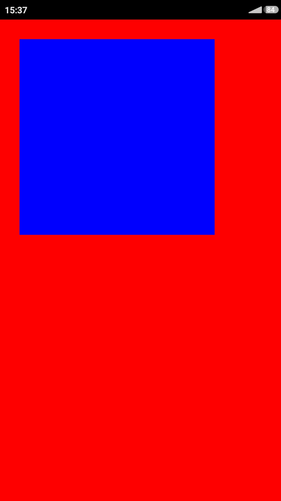

# D SDL2 Android demo project

This demo provides a basic skeleton for Android app, it has Java code that loads shared library with SDL main entry function.

Even though not very busy on graphics, it has everything to start making SDL apps.  

For step-by-step instructions see [readme](guide/README.md) in guide folder.

On screenshot you can see demo app running on Android phone with a blue rectangle on red background.

